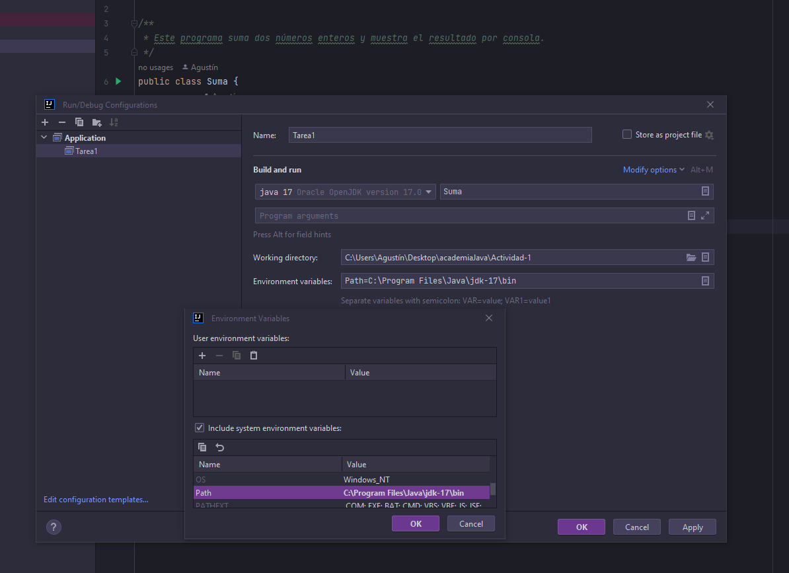

Actividad 1. Suma de dos numeros.
En este caso el usuario los ingresa a través del objeto Scanner y retornamos el resultado manejando previamente las posibles excepciones.

CONFIGURACIÓN DE ENTORNO:

